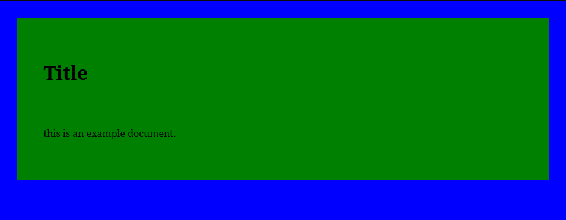

# Flaarc - (F)untional (La)tex-like M(ar)kdown Clone, With Some (C)-like Syntax. Also Lisp, Too.
##  What is it; Why should I use it?
I made this project because I was unhappy with Latex, as it's tough to write short documents in it, but I also didn't
want to use Markdown, because it'd lack many features present in Latex. Flaarc is supposed to have a syntax that
resembles normal text as little as possible, that way when you don't need the features, you don't have them, but when
you do, they're fairly easy to use. Does this mean you should use it? Probably not, at least not yet. As it is
*very* much **alpha quality**, I wouldn't recommend it for anything remotely serious. As a fun thing to try? Sure.

##  Using It From The CLI
The basic syntax is as follows:
(path to flaarc bin) -i (input file) -f (format) -o (output file)

Please note that while the format and output files aren't required, as they default to "markdown" and "out.md" respectively, the input file **is** required.

Some other options include:

- --help / -h:	print help info
- 	frog:		Don't worry about it.

list of output formats supported.

|format|name in the -f flag|Description|
|---|---|---|
|Markdown|markdown|markdown|
|HTML|html|HTML|
|Intermediate Representation|IR|Text from the format parser|
|Text|text|Plain text|
|Logic|logic|Text from the logical parser|

##  Basic Formatting; Italics, Bold, Superscripts, Subscripts, and Highlights.
Italics can be defined with the text intended to be italicized surrounded by "//".
For example, "//italic text//" makes "*italic text*"

Bold is almost identical, but instead of surrounding the text with "//" you surround it with "\_\_"
For example, "\_\_bold text\_\_" becomes "**bold text**"

If you want to type \_\_ or // **without** bolding or italicizing the text, precede the chars with a backslash.
For example, to type \_\_, you would type \\\_\_ instead.

Superscripts are similar. If you want "x2", you would type "x\\2\\".

Subscripts are quite diffent, for this you need to use the "sub" function. For example, to type "H2O", you'd type "H{sub:2}O". See the "Functions" section for more details on how functions work.

Highlighting works just like subscripts in that it uses a function, this time the "mark" function. If you want to type "<mark>highlight</mark>", you'd type "{mark:highlight}"

Crossout work more like bold and italics, but instead of "\_\_" or "//", it's "--".
For example, "--STRIKE--" becomes: "~~STRIKE~~".

##  Hashes
Hashes are lines that begin with the '\#' symbol. There are a few types of hashes:

\#\#: this is a note, a line that starts with two hashes **and a space** will be discarded by the Flaarc parser.

\#section {name}: make a section, this means make a \<h2\> tag in the emmitted HTML.

\#title {title}: set the title, this will be the title of the webpage and will be printed at the top, defaults to: "title". Creative, I know.

\#setfont {font} set the font.

\#image {path\_to\_image}, include image in document.

\#quote {text to quote} quote the text

to type a \# on its own, ensure it's preceded by a backslash, like this: \\\#.

##  Functions
Functions in Flaarc are just programs. You can make your own functions by copying the executable file into "/lib/flaarc".
The syntax of a function is as follows:
{ FUNCTION\_NAME\_HERE : FUNCTION ARG HERE }
Upon seeing this, the parser will try to run a program in the directory /lib/flaarc and will pass the "FUNCTION ARG HERE" section as **one** CLI argument to the program. Anything the program writes to the standard output will be parsed and then put in the document. Because it's parsed, it's syntactically legal to declare variables and even call other functions within the output of the program. 
Note: if the function is called without a ':', and therefore no argument to pass to the program, it will run the program without passing anything to it.

One way this could be used is if you want to be able to import your name, make a title, etc. **without** having to retype it every time you make a new document, you could make a function that you could call at the beginning of the document that returns the needed text.

There are reserved functions:

- The list function makes lists.
- 	The link function makes links.
- 	The right function aligns the text to the right.
- 	The center function aligns the text to the center.
- 	The sub function makes the text a subscript.

##  Variables
To declare a variable, you need a "\#" preceded by a newline, immediately proceeded by the text "define", then a space, then the name of the variable, then a space, then the content of the variable, and finally, a newline.
For example, if you want to declare the variable "x" and set it to contain "this is in x!" you'd type:

\#define x this is in x!

To use a variable within text, type the variable's name preceded by a '$', and proceded by a space. Note that the space will be ignored, if you want a space after a variable, type two spaces.
To access the contents of x, we could say:

I've set the variable x to "$x ".
This will be converted to:
I've set the variable x to "this is in x!".

Note how the space following $x is present *before* parsing, but not after.

Some variables are defined by the parser, **not** the user, however the user can redefine them as they please.

The following is a full list of the default variables and their values.

|Variable|Description|
|---|---|
|version|current of the parser|
|year|current year|
|month|current month|
|day|current day of the month|
|invbang|¡|
|copy|©|
|reg|®|
|deg|°|
|plusmn|±|
|micro|µ|
|theta|ϴ|
|omega|Ω|
|alpha|α|
|beta|β|
|gamma|γ|
|delta|Δ|
|sigma|Σ|
|pi|π|
|cap\_omega|Ѡ|
|bullet|•|
|block|█|
|light\_shade|░|
|med\_shade|▒|
|dark\_shade|▓|
|thunder|⚡|
|fist|✊|
|check|✔|
|x|✘|
|sparkle|✨|
|cross|❌|
|black\_heart|❤|
|smile|😀|
|veryfunny|😂|
|smile2|😃|
|embarrassment|😅|
|cool|😎|
|smirk|😏|
|apathy|😐|
|crying|😢|
|ono|😳|
|Smile|🙂(yes, they're case-sensitive)|
|nerd|🤓|
|brain|🧠|
|cap|🧢|
|frog|don't worry about it|
|the following vars are AFTER a char|IE:a$var|
|accute|x ́|
|overline|x ̅|
|diaresis|x ̈|

##  Tables
Tables are a fuction with the following syntax:

{table:
item 1a|item 1b

item 2a|item 2b
}

This would produce the following table:

|item 1a|item 1b|
|---|---|
|item 2a|item 2b|

##  Style($cool )
styles are defined by hashes.

to set the font, use "setfont". For example, to set the page's font to times,
\#setfont times

to set the background color, use "setbgcolor". For example, to set the background's color to blue,
\#setbgcolor blue

to set the page's color, use "setpagecolor". For example, to set the page's color to green,
\#setpagecolor green

to set the page's padding(the gap from the page to the border), use "setpagepadding". For example, to set the page's padding to 3%:
\#setpagepadding 3

to set the text's padding(the gap from the page's border to the text/content), use "set text padding". For example, to set the text's padding to 5%,
\#settextpadding 5.

all of these together would produce the following page.

##  Features I want to add/TO DO:

- better installer.
- 	windows OS support.
- 	web image support.
- 	**good** standard library of functions.
- 	an optional GUI.
- 	support for more advanced styling
- 	support for gemtext
- 	include other files that will be parsed and then linked to.
- 	local links.
- 	add support for changing BG color/image
- 	add support for "formatted" html
